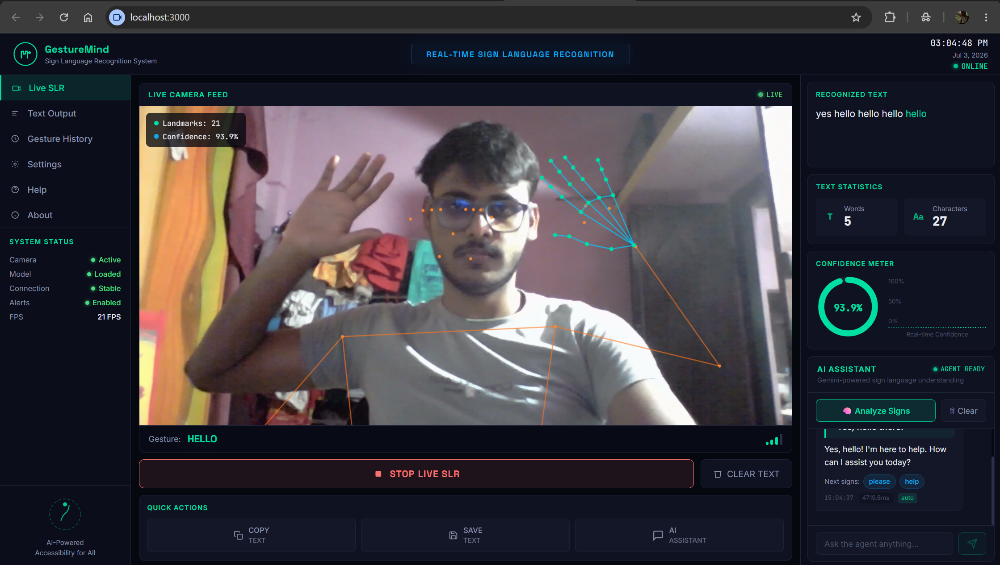
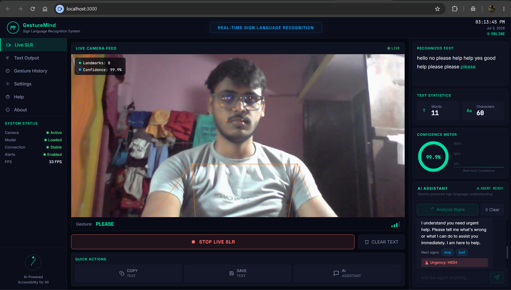
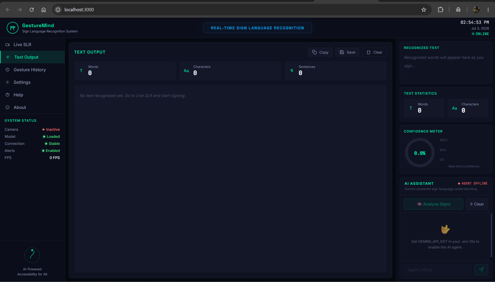

# 🧠 GestureMind
### Real-Time ASL Sign Language Recognition — with an AI That Actually Understands You

<div align="center">

## 📷 Main Dashboard

<p align="center">
  
</p>

## ✋ Live Sign Detection

<p align="center">
  
</p>

## 💬 getting alert

<p align="center">
  
</p>

## 📝 Generated Text

<p align="center">
  
</p>


**A hand shows up on camera. Thirty frames later, GestureMind doesn't just know what
you signed — it knows what you meant, and if you're in trouble, it tells someone who
can help. No gloves. No app. Just a browser and a webcam.**

<br/>

</div>

---

## 📖 Table of Contents

- [Why This Exists](#-why-this-exists)
- [Key Features](#-key-features)
- [See It In Action](#-see-it-in-action)
- [System Architecture](#️-system-architecture)
- [Agentic AI Layer](#-agentic-ai-layer)
- [Model Details](#-model-details)
- [Tech Stack](#-tech-stack)
- [Setup & Installation](#-setup--installation)
- [Project Structure](#-project-structure)
- [Evaluation Results](#-evaluation-results)
- [Roadmap](#️-roadmap)
- [Known Limitations](#️-known-limitations)
- [Acknowledgements](#-acknowledgements)

---

## 🎯 Why This Exists

Over 430 million people worldwide live with disabling hearing loss, and millions more
communicate primarily through sign language. Yet the tools that translate sign
language into something a hearing person can understand are rare, expensive, or
require specialized hardware.

**GestureMind** closes that gap with nothing but a webcam:

- Converts ASL hand gestures into text, live, as you sign
- Understands *intent*, not just individual words, using an agentic AI reasoning layer
- Recognizes distress signals and can **automatically email a caregiver** if the user
  signs for help — no manual step required
- Runs entirely in the browser — no installs, no wearables, no cost barrier

---

## ✨ Key Features

| Feature | Description |
|---|---|
| 🎥 **Real-Time Recognition** | 20+ FPS gesture detection straight from your webcam |
| 🧠 **LSTM Classifier** | 93.3% test accuracy across 10 ASL signs |
| 🤖 **Gemini Agent** | Forms sentences, infers intent, detects urgency — not just word lookup |
| 💬 **AI Chat Interface** | Ask the agent questions in plain English, get context-aware answers |
| 🚨 **Autonomous Urgency Alerts** | Detects a "help" signal and emails a designated contact automatically |
| 📊 **Live Confidence Meter** | See exactly how sure the model is, in real time |
| 🕘 **Gesture History** | Full timestamped log of every sign recognized this session |
| ⚙️ **Live Settings Panel** | Check model status, thresholds, and alert configuration at a glance |
| 🌐 **Zero Install** | Runs in Chrome/Firefox — nothing to download for the end user |

---

## 🎬 See It In Action

<!-- 📸 SCREENSHOT: Live SLR in action — person signing with landmarks overlaid -->


<br/><br/>

<!-- 📸 SCREENSHOT: AI Assistant panel showing a formed sentence + urgency detection -->


<br/><br/>

<!-- 📸 SCREENSHOT: Gesture History panel -->


<br/><br/>

<!-- 📸 SCREENSHOT (optional): Emergency email alert received in inbox -->


> *Place your screenshots inside `docs/screenshots/` using the filenames above, or
> swap in your own paths — GitHub will render them automatically once pushed.*

---

## 🏗️ System Architecture

```
┌─────────────────────────────────────────────────────────────────┐
│                        BROWSER (React)                          │
│  ┌──────────────┐   ┌─────────────────┐   ┌─────────────────┐  │
│  │  Live Camera │   │  MediaPipe JS   │   │   AI Assistant  │  │
│  │     Feed     │──▶│  Hand + Pose    │   │     Panel       │  │
│  │  (Canvas)    │   │  Landmark       │   │  (Gemini 2.5)   │  │
│  └──────────────┘   │  Extraction     │   └────────▲────────┘  │
│                     └───────┬─────────┘            │           │
└─────────────────────────────┼────────────────────────────────--┘
                              │ POST /predict          │ POST /agent
                              ▼                        │
┌─────────────────────────────────────────────────────────────────┐
│                     FASTAPI BACKEND                              │
│  ┌─────────────────────┐     ┌──────────────────────────────┐  │
│  │   LSTM Classifier    │     │      Gemini Agent Layer      │  │
│  │  gesturemind_model    │     │  Tools:                     │  │
│  │     .keras           │     │  • form_sentence             │  │
│  │  Input: (1,30,1662)  │     │  • detect_urgency            │  │
│  │  Output: 10 classes  │     │  • infer_intent               │  │
│  │  Accuracy: 93.3%     │     │  • suggest_completion         │  │
│  └─────────────────────┘     │  Memory: conversation history │  │
│                               └──────────┬───────────────────┘  │
│                                          │ urgency == HIGH       │
│                                          ▼                       │
│                               ┌──────────────────────────────┐  │
│                               │  Email Alert Service (SMTP)  │  │
│                               │  Auto-notifies your contact  │  │
│                               └──────────────────────────────┘  │
└─────────────────────────────────────────────────────────────────┘
```

---

## 🤖 Agentic AI Layer

GestureMind doesn't stop at classification — it reasons over what's being signed using
**Gemini 2.5 Flash** with four purpose-built tools:

```
form_sentence       → Converts raw signs into grammatical English
detect_urgency      → Flags distress signals (e.g. "help") and their severity
infer_intent        → Makes sense of partial or ambiguous sign sequences
suggest_completion  → Predicts what the user is likely to sign next
```

### Agent Flow

```
ASL Signs Detected
      ↓
  [LSTM Classifier] → gesture + confidence
      ↓
  [Gemini Agent] → reasons over signs + conversation history
      ↓
  Applies tools → form_sentence + detect_urgency + infer_intent
      ↓
  Returns: sentence + intent + urgency level + suggestions
      ↓
  UI updates + 🚨 email alert fires automatically if urgency == HIGH
```

### Example

```json
Input signs: ["hello", "help", "please"]

Agent output: {
  "sentence"        : "Hello, could you please help me?",
  "intent"          : "User is greeting and requesting assistance",
  "urgency"         : "HIGH",
  "urgency_message" : "⚠️ User may need help!",
  "suggestions"     : ["sorry", "thank_you"],
  "agent_message"   : "I can see you need help. Is everything okay?",
  "email_alert_sent": true
}
```

That last field isn't decorative — when urgency hits `HIGH`, GestureMind really does
send a real email, with no human clicking "send."

---

## 🧠 Model Details

| Parameter | Value |
|---|---|
| Architecture | 3-layer LSTM + BatchNorm + Dropout |
| Input shape | (30 frames, 1662 features) |
| Output | 10 ASL classes (softmax) |
| Train / Val / Test split | 80% / 10% / 10% (stratified) |
| Test accuracy | **93.3%** |
| Total parameters | ~2.1M |
| Training time (CPU) | ~8 minutes |
| Inference time | ~12ms per prediction |

### Feature Vector (1,662 per frame)
```
Pose landmarks  : 33 × 4  = 132
Face (reserved) : 468 × 3 = 1404  (zero-padded, not used for ASL)
Left hand       : 21 × 3  = 63
Right hand      : 21 × 3  = 63
```

### ASL Signs Supported
`hello` · `thank_you` · `please` · `yes` · `no` · `sorry` · `help` · `good` · `bad` · `stop`

---

## 📦 Tech Stack

| Layer | Technology |
|---|---|
| Data Collection | Python · OpenCV · MediaPipe 0.10.21 |
| Model Training | TensorFlow 2.18 · Keras LSTM |
| Backend | FastAPI · Uvicorn · Python 3.10.11 |
| Agentic AI | Google Gemini 2.5 Flash (`google-generativeai`) |
| Alerts | Gmail SMTP (`smtplib`) with HTML email + cooldown |
| Frontend | React 18 · MediaPipe JS (CDN) |
| Communication | REST API (JSON) |

---

## 🚀 Setup & Installation

### Prerequisites
- Python 3.10.11
- Node.js 20+ (LTS)
- A webcam
- A [Gemini API key](https://aistudio.google.com) (free tier works)
- A Gmail account + [App Password](https://myaccount.google.com/apppasswords) (for alerts)

### 1. Get the project
```bash
cd D:/Downloads/data_collection
```

### 2. Create a Python virtual environment
```bash
python -m venv env310
env310\Scripts\activate        # Windows
```

### 3. Install backend dependencies
```bash
cd backend
pip install -r requirements.txt
pip install tensorflow==2.18.0
```

### 4. Configure environment variables
Create `backend/.env`:
```bash
GEMINI_API_KEY=your_gemini_api_key_here
PROJECT_DIR=D:\Downloads\data_collection

GMAIL_ADDRESS=your_gmail_address@gmail.com
GMAIL_APP_PASSWORD=your16digitapppassword
ALERT_RECIPIENT_EMAILS=parent@example.com,friend@example.com
```

### 5. Start the backend
```bash
uvicorn main:app --host 0.0.0.0 --port 8000 --reload
# Verify at: http://localhost:8000/health
```

### 6. Install & start the frontend
```bash
cd ../frontend
npm install
npm start
# Opens: http://localhost:3000
```

### 7. Use GestureMind
1. Confirm `http://localhost:8000/health` shows `"model_loaded": true`,
   `"agent_loaded": true`, and `"email_alerts_ready": true`
2. Open `http://localhost:3000`
3. Click **START LIVE SLR** and allow camera access
4. Perform ASL signs — recognized text builds up in the right panel
5. Click **Analyze Signs** in the AI Assistant panel to get a full sentence,
   intent, and urgency assessment
6. Sign **"help"** to see the autonomous email alert in action

---

## 📁 Project Structure

```
data_collection/
│
├── backend/
│   ├── main.py                 # FastAPI server — predict, agent, and alert endpoints
│   ├── agent.py                # Gemini agentic layer + tool definitions
│   ├── email_alert.py          # Gmail SMTP urgency alert service
│   ├── requirements.txt
│   ├── .env                    # API keys & config (never commit this)
│   └── trained_model/
│       ├── gesturemind_model.keras
│       ├── labels.json
│       └── training_curves.png
│
├── frontend/
│   ├── public/
│   │   └── index.html
│   ├── src/
│   │   ├── App.js              # Main dashboard (Live SLR, Text Output, History, Settings, Help, About)
│   │   ├── App.css
│   │   ├── AgentPanel.js       # AI Assistant chat panel
│   │   └── AgentPanel.css
│   ├── package.json
│   └── .env
│
├── ml_pipeline/
│   ├── 01_data_collection.ipynb
│   ├── 02_train_model.ipynb
│   └── realtime_test.py        # Local end-to-end test, no browser required
│
├── models/                     # MediaPipe task files
├── MP_Data/                    # Training dataset — 45,000 landmark frames
├── docs/
│   └── screenshots/            # 📸 Project screenshots live here
├── README.md
└── .gitignore
```

---

## 📊 Evaluation Results

```
Test Accuracy  : 93.3%
Test Loss      : 0.2744
Macro Avg F1   : 0.933
```

| Sign | F1 Score |
|---|---|
| hello | 0.909 |
| thank_you | 0.929 |
| please | 0.966 |
| yes | 0.938 |
| no | 0.889 |
| sorry | 0.968 |
| **help** | **1.000** ✅ |
| good | 0.867 |
| bad | 0.867 |
| **stop** | **1.000** ✅ |

> The `help` sign — the one wired directly to the emergency-alert feature — classifies
> with **perfect precision and recall** on the held-out test set.

<!-- 📸 SCREENSHOT: Confusion matrix from 02_train_model.ipynb -->


---

## 🗺️ Roadmap

- [ ] Expand to 50+ ASL signs
- [ ] Two-hand compound gesture support
- [ ] Sentence-level (not word-by-word) recognition
- [ ] Mobile app (React Native)
- [ ] Multi-language support (ISL, BSL)
- [ ] Offline inference via TensorFlow Lite
- [ ] SMS alerts as a fallback to email
- [ ] Docker containerization for one-command deployment

---

## ⚠️ Known Limitations

- Currently supports 10 ASL signs (architecture scales — dataset doesn't, yet)
- Needs reasonably good lighting for accurate landmark detection
- `good`/`bad` and `yes`/`no` show mild confusion (~13% error) due to similar motion paths
- The Gemini agent and email alerts require an internet connection — the LSTM
  classifier itself runs fully offline

---

## 📄 License

MIT License — free for personal and commercial use.

---

## 🙏 Acknowledgements

- [MediaPipe](https://mediapipe.dev) — hand and pose landmark detection
- [Google Gemini](https://deepmind.google/technologies/gemini/) — agentic reasoning layer
- [TensorFlow](https://tensorflow.org) — LSTM model training
- [FastAPI](https://fastapi.tiangolo.com) — backend framework
- [React](https://react.dev) — frontend framework

---

<div align="center">

Built with ❤️ for accessibility · **GestureMind** 2026

*If a hand can say it, GestureMind can hear it.*

</div>
